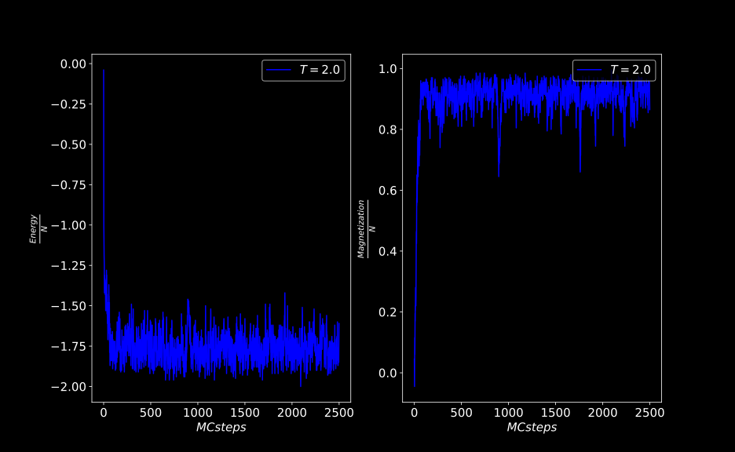

# Under Construction..

# Ising Model

The Ising model is a simple model of a magnet. Its study is a very good introduction to the computational method that simulates it, the Monte Carlo (MC) method. Although an exact solution for the three dimensional model has not yet been found, there are approximate and computational methods that try to describe its properties. Nevertheless, the Ising model in two dimensions is the most thoroughly researched model in Statistical Physics and there is only one computational method that can simulate this model, the MC method.

Here I just write about my own simulation and what I have understood about this model. I made this attempt in order to practice the MC method myself but it doesn't mean what I write here or the code I provide is completely correct. Moreover, it's certainly not a complete study of the model. For a pretty thorough introduction to the MC method applied on the Ising model there is an excellent [book][the book] which I highly recommend written by M.E.J. Newman and G.T. Barkema.

## Model

To start briefly with the description of the model in two dimensions, it explains how the magnetism of a bulk material arises from a collection of interacting magnetic dipole moments of many atomic spins within the material.

|{: .center-image }|
|:--:|
|Collection of magnetic moments.|

There is a square (or of any other geometry) lattice in two dimensions which has a magnetic dipole or spin placed on each site. In the simplest case, these spins can have 2 states, up or down and they are represented by two integer values (1 and -1). The spins interact through exchange or other interactions. The interactions take place between the nearest neighbors on the lattice which means that every spin interact with its four neighbors (up, down, left and right). If we assume the presence of an external magnetic field \\(B\\), the Hamiltonian of the system has the following form.

\\[H = -J\sum_{ij}{s_is_j} - B\sum_{i}{s_i}\\]

Where the first sum is between nearest neighbors. The J parameter is the interaction parameter, when it has a positive value the model describes a ferromagnetic material meaning all the spins want to line up with one another. On contrary, when J is negative, we have an anti-ferromagnetic material model where the neighbor spins point at opposite direction.

We have N spins placed on a square lattice and each spin can be in 2 states (up or down), so the system has in total \\(2^N\\) states. Every state is just a different set of values that all spins can take. For a system that follows the Boltzmann probability distribution, every state \\(\mu\\) of the system occurs with probability 

\\(p_\mu = \frac{e^{-\beta E_\mu}}{Z}\\)

where \\(E_\mu\\) is the energy of the \\(\mu\\) state and \\(\beta = \frac{1}{kT}\\) is the Boltzmann parameter where \\(k = 1.38\times10^{-23}JK^{-1}\\) is the Boltzmann's constant. The Z parameter is the **partition function** of the system. It's a sum of probabilities of all the states of the system and is a normalization factor.

\\(Z = \sum{e^{-\beta E_\mu}}\\)

Our purpose is to find the best estimate of the expectation value of the quantities of interest at a certain temperature or over a range of temperatures.
The partition function contains all the information we need about the system's macroscopic behavior. The partition function allows us to estimate thermodynamic quantities of the system and the most common ones for the Ising model are the internal energy \\(U = -\frac{\partial \log{Z}}{\partial\beta}\\), the magnetization, the specific heat \\(C = \frac{\partial U}{\partial T}\\) and the magnetic susceptibility. However, it's impossible to solve the Hamilton's equation for such a large number of states. Therefore, we might follow a different approach and solve the problem using a computational method.

## Method

During the course of a simulation on a system like the one the Ising model describes, we want to answer questions like, what is the average energy or magnetization of the system at this or that temperature when the system has reached the equilibrium state? how do these quantities change with respect to temperature?

The most straightforward approach is to define a square lattice of a finite size N. Thus, the partition function is a sum of a finite number of states. This also introduces finite size effects in our simulation. The size of the lattice is one parameter that might affect our results. The larger, the better but it takes more time to get the results. 

The second step is to initialize the lattice by placing every spin with an initial state 1 or -1. There are two most common initial states for the Ising model. The first one is \\(T = 0\\) where all the spins are in the same state 1 or -1, a state of order. The second state is \\(T = \infty\\) where we randomly initialize all the spins, about half of the spins point up and the rest down. The choice of the initial state might affect the time needed for the system to reach equilibrium. For example if we simulate the system at low temperatures where thermal fluctuations are smaller and start from a state of \\(T = 0\\), it is more likely to reach equilibrium faster than starting the system from a \\(T = \infty\\) state. Because we usually simulate the system at different temperatures, there is also another (third) initial state we can use. We can use as an initial state the equilibrium state of the system that we got in the previous simulation.

The next step is to define the interaction of the system. For the Ising model, many interesting properties of the system can be observed in the absence of an external magnetic field. In this case the energy of the system is given by the first sum of the Hamiltonian

 \\(H = -J\sum_{ij}{s_is_j}\\). 
 
The final step is to define the computational method which is going to simulate the physical system. There are many Monte Carlo algorithms but here I use the simplest and the oldest one, the Metropolis algorithm. The Metropolis algorithm is an iterative computational method where at every step the state of the system changes randomly until it finally reaches the equilibrium state. That way we simulate the random thermal fluctuation of the system from state to state. When the system reaches equilibrium, we can sample the quantities of interest over the equilibrium states. One advantage of this method is that we only need to sample a small fraction of the states of the system in order to get accurate estimates of physical quantities but this also introduces statistical errors in the calculation. The steps of the algorithm for the Ising model which define the dynamics (the rule) for changing from one state to another are the following: For a system that is currently at the \\(\mu\\) state, in order to reach the new state \\(\nu\\)
* select a spin at random and change its state.
* calculate the energy difference between its new and old state \\(\Delta E = E_\nu - E_\mu\\).
* if \\(\Delta E <= 0\\) accept the new state \\(\nu\\) of the spin.
* else if \\(\Delta E > 0\\) generate a uniform random number r in the interval \\([0,1]\\) and if
\\(e^{-\beta \Delta E} > r\\) accept the new state \\(\nu\\).
* else if none of the above occurs, keep the spin to its old state \\(\mu\\).
* repeat until we reach the equilibrium states.

This is the Metropolis algorithm with single-spin-flip dynamics because at every step we choose one spin and change its state. When we finally reach the equilibrium states, we continue this procedure for a suitably long time in order to sample the quantities of interest. 

This is the usual procedure we follow when we want to simulate a physical system using the MC method. Just like an experiment in the laboratory, we set the parameters and the initial state of the system, we define the interaction, how the system interacts with the environment and we use the computational method which simulates the system's behavior during the experiment.

## Simulation

You can find the code of the implementation [here](). Any suggestions or improvements are always welcomed!

We start off by defining a 2 dimensional lattice. A common choice is a square lattice with equal number of rows and columns. I created a simple class named lattice which has as its members 2 integers, the number of rows and columns and one 2 dimensional vector of type int which stores the spins of the system. (I could have done this by using only a 2D or even 1D vector by I chose this way.)
```cpp
class Lattice {

public:

    Lattice(const int& r, const int& c):m_rows{r}, m_columns{c}
    { }

    void initialize(const int& state = 0);
    int rows()const{return m_rows;}
    int columns()const{return m_columns;}
    int size()const{return m_rows * m_columns;}

    int index(const int& i, const int& j)const{return m_lat[i][j];}
    int& index(const int& i, const int& j){return m_lat[i][j];}

    void spinsState()const;
    void configuration(std::ofstream&, std::string);

private:

    int m_rows;
    int m_columns;
    std::vector< std::vector<int> > m_lat;

};

```
After we've defined the lattice we need to initialize the spins' value. The method *initialize()* does this work. It has a default argument which is the state of all spins. If the value 1 is provided then all the spins are pointing up. If the value -1 is provided, all the spins are pointing down. If no value is provided, the spins are initialized in a random state where half of them are pointing up and the rest down. 
```cpp
void Lattice::initialize(const int& state)
{
    std::uniform_real_distribution<double> rand;
    if(state == 0)
    {
        for(int i = 0 ; i < m_rows ; ++i)
        {
            vector<int> v;
            for(int j = 0 ; j < m_columns ; ++j)
            {
                if(rand(gener) < 0.5)
                {
                    v.push_back(1);
                }
                else
                {
                    v.push_back(-1);
                }
            }
            m_lat.push_back(v);
        }
    }
    else 
    {
        for(int i = 0 ; i < m_rows ; ++i)
        {
            vector<int> v;
            for(int j = 0 ; j < m_columns ; ++j)
            {
                v.push_back(state);
            }
            m_lat.push_back(v);
        }
    }
}
```
The rest of the methods are just getters. The spinsState method prints to the standard output how many spins are up and down. The configuration method writes the current configuration of spins to a file.

What the lattice also needs is the boundary conditions. This is necessary when we calculate the energy of every single spin or the system's energy, because every spin must have 4 neighbors including the spins at the boundaries. I use periodic boundary conditions which are placed inside the routines that calculate these energies. These conditions are implemented by 2 for loops, one for rows and one for columns. When a neighbor has a negative index (ii or jj < 0) we add the number N (for a NxN lattice) to its index and the new one is (N-1) because the only negative value they could have is -1. When their index is greater than or equal N we subtract N from it and now it's 0 because the greater index they could have is N.
```cpp
for(int k = i-1 ; k < i+2 ; k += 2)
            {
                int ii = k;

                if(k < 0)
                    ii += r; 
                if(k >= r)
                    ii -= r;

                //calculate the energy of spin (i,j) with the neighbor (ii,j) 
            }

for(int k = j-1 ; k < j+2 ; k += 2)
            {
                int jj = k;

                if(k < 0)
                    jj += c;
                if(k >= c)
                    jj -= c;

                //calculate the energy of spin (i,j) with the neighbor (i,jj)
            }
```

We now have our system which is a 2D vector of integers. Next we need to simulate the system. There is a second class named Simulation. It has 4 member variables, the total number of steps of the simulation, the accepted steps of the algorithm, the temperature at which we simulate the system and the interaction parameter J. The method pdf returns the exponential function \\(f(x) = e^{-x}\\). We can optionally use the thermalization method at the beginning of our simulation to warm up the random number generators and the frequency function to throw out some random numbers at every step of the algorithm in order to reduce correlations between the random states but I haven't used that last one. **(Note: It's probably a bad idea to have defined some of these functions as methods)**.   

```cpp
#include "lattice.h"


class Simulation {


public:

    Simulation(const int& n, const double& t, const double& par):
        Nsteps{n},
        accepted{0},
        temperature{t},
        J{par}
    { }

    int steps()const{return Nsteps;}
    int accpt()const{return accepted;}
    double temp()const{return temperature;}
    double pdf(const double& x){return exp(-x);}
    void thermalization(const int&, const int&);
    void frequency(const int&, const int&);
    double energy(const Lattice&);
    double spinEnergy(const Lattice&, const int&, const int&);
    double magnetization(const Lattice&);
    Lattice metropolis(const Lattice&, double&, double&, std::ofstream&);

private:

    int Nsteps;
    int accepted;
    double temperature;
    double J;

};
```
The energy method returns the total energy of the system and it is only used once at the beginning of the simulation. The same applies for the magnetization method which returns the total magnetization (the sum of all spins). They are used once because at every step we can get the new energy and magnetization of the system by just make use of \\(E_{new} = E_{old} + \Delta E\\) and \\(M_{new} = M_{old} + \Delta M\\). 

The total energy of the system is the sum of the energies of all spins. 
```cpp
double Simulation::energy(const Lattice& lat)
{
    double energy = 0.;
    int r = lat.rows();
    int c = lat.columns();

    for(int i = 0 ; i < r ; ++i)
    {
        for(int j = 0 ; j < c ; ++j)
        {

            energy += spinEnergy(lat, i, j);
        }
    }

    return -J * energy;
}
``` 

Where the energy of every spin is given by the spinEnergy method. This method is called at every step of the metropolis algorithm.

```cpp
double Simulation::spinEnergy(const Lattice& lat, const int& i, const int& j)
{
    double s = 0;
    int r = lat.rows();
    int c = lat.columns();

    for(int k = i-1 ; k < i+2 ; k += 2) //left and right neighbors
    {
        int ii = k;          // k:(i-1, i+1)
        if(k < 0)            // when i == 0, k == -1
            ii += r;         // then k = N-1
        if(k >= r)           // when i == N-1, k == N
            ii -= r;         // then k = 0

        s += lat.index(ii,j);
    }

    for(int k = j-1 ; k < j+2 ; k += 2) //up and down neighbors
    {
        int jj = k;          // k:(j-1, j+1)
        if(k < 0)            //the same as above for columns
            jj += c;
        if(k >= c)
            jj -= c;

        s += lat.index(i,jj);
    }

    return lat.index(i,j) * s;
}
```
The last method is the metropolis algorithm. It takes as inputs the lattice, the energy, the magnetization and one extra parameter of type ofstream which I need for a visualization of the algorithm with OpenGL. The output of the method is the new state of the lattice. At every step the energy and the magnetization as well as the lattice change if the step is accepted, otherwise they remain the same.
```cpp
Lattice Simulation::metropolis(const Lattice& lat, double& energy, double& magnetization, ofstream& out)
{
    uniform_int_distribution<int> randRows(0, lat.rows()-1), randCols(0, lat.columns()-1);
    uniform_real_distribution<double> rand;
    Lattice temp = lat;
    double beta = 1./temperature;

    int i = randRows(gen_rows);
    int j = randCols(gen_cols);

    int spin_index{0};

    double dE = 2. * J * spinEnergy(temp, i, j);

    if(dE <= 0.)
    {
        temp.index(i,j) *= -1;
        accepted++;
        energy += dE;
        magnetization += 2. * temp.index(i, j);
	    spin_index = lat.rows() * i + j; //no 10*i because when rows < 10 gives seg fault
        out << spin_index << endl;
        return temp;
    }
    else if(pdf(dE * beta) > rand(gen))
    {
        temp.index(i, j) *= -1;
        accepted++;
        energy += dE;
        magnetization += 2. * temp.index(i, j);
        spin_index = lat.rows() * i + j;
        out << spin_index << endl;
        return temp;
    }
    else
    {
        return lat;
    }

}
```
Inside the method I create a temporary lattice temp which is equal to the input lattice. From that temporary lattice the algorithm chooses one spin at random and changes its state. If the step is accepted the temp lattice is returned otherwise the input lattice is returned. The spin_index variable maps the 2D index of the spin to a 1D index for one dimensional array I use in OpenGL (where I just need the initial state of the lattice and the index of every spin that changes).

The new energy of the system as said above is \\(E_{new} = E_{old} + \Delta E\\). It turns out that the energy difference is \\(E_\nu - E_\mu = 2Js_{k}^{\mu}\sum{s_i^\mu}\\), that means that we know the energy difference of the selected spin before we change its state. So at every step we first calculate \\(\Delta E\\) and according to the algorithm if the step is accepted we change its state otherwise we keep the same old state.

The same applies for the magnetization \\(M_{new} = M_{old} + \Delta M\\). But now \\(\Delta M\\) is just the new state of the selected spin except that we must multiply its state with 2. That's because if the state of the spin was -1 and the new one is 1 we get (-1 + 1 = 0), we added nothing to the total magnetization. But if we multiply the new state with 2 then (-1 + 2*1 = 1).

Now that we've defined all the methods of our simulation, the main file should be pretty small (as all the code is). 
```cpp
    Lattice lat(20, 20);
    lat.initialize();

    int N = lat.size();

    Simulation S(10000000, 2.4, 1.);
    S.thermalization(lat.rows(), lat.columns());

    ofstream out, en_out, mag_out, visual;
    en_out.open("energy.dat");
    mag_out.open("magnetization.dat");
    visual.open("indices.dat");
    visual << lat.rows() << endl;

    double energy = S.energy(lat);
    double magnetization = S.magnetization(lat);

    lat.spinsState();
    lat.configuration(out, "init_state.dat");


    for(int t = 0 ; t < S.steps() ; ++t)
    {
        lat = S.metropolis(lat, energy, magnetization, visual);

	   if(t % N == 0)
	   {
        	en_out << energy/N << endl;
        	mag_out << magnetization/N << endl;
	   }
    }

    lat.spinsState();
    lat.configuration(out, "final_state.dat");

    cout << "Steps:" << S.steps() << endl;
    cout << "Accepted:" << S.accpt() << endl;

    out.close();
    en_out.close();
    mag_out.close();
    visual.close();
```
The usual procedure is to create a lattice object (here 20x20) and initialize its state (here random) and get its size. Next we create a simulation object with the total number of steps, the temperature at which we run the simulation and the interaction parameter. Next we warm up the random number generator (I use the Mersenne Twister std::mt19937), create some ofstreams to store the values of the quantities of interest such the configuration of the spins, the energy, the magnetization and the indices I use for the visualization. Next we calculate the initial energy and magnetization of the system, we print to the standard output how many spins point up and down initially and store the initial configuration inside a file.

After that, we apply the Metropolis algorithm inside a for loop for a number of steps that we've defined at the beginning. While the algorithm is applied we store the value of the total energy and magnetization per spin every 1 MC step which is the time we need to make N spin flips (all the spins are flipped on average), thus we sample these values after N steps where N is the size of the lattice. This also helps reduce the correlation between the sampled values. 

Finally, after the algorithm has finished, we print to the standard output again how many spins are up and down, we store the final configuration in a file and print the total and accepted steps.

## Results

When you do an MC simulation, implementing the code of the simulation is not enough, you must also correctly analyze the output of the algorithm. That is also one difficult and important part of the whole process. In the present problem, we want every time to simulate the system at constant temperature and find out what is the value of the energy, magnetization and of their fluctuations which are the specific heat and magnetic susceptibility. We want to do this for a set of temperature values in order to see how these quantities behave with respect to those temperatures.

To achieve that, for every temperature we sample the energy and the magnetization at each step of the algorithm. In particular, we sample the energy per spin and the magnetization per spin which are \\(\epsilon = \frac{E}{N}\\), \\(m = \frac{M}{N}\\). We do that every 1 MC step which consist of \\(N\\) steps of the algorithm. 

For instance, if we simulate the system at a certain temperature, the output we get is something like what the following figure shows. At the beginning the two quantities change rapidly and after some MC steps they reach equilibrium where they fluctuate around their mean value. What we can do is to omit those values at the beginning and calculate their mean value using their equilibrium states.

|{: .center-image }|
|:--:|
|Samples of Energy and Magnetization at a certain temperature.|

Before we do this calculation, we must first see if there are any correlations between those states. Every new state that the algorithm produces depends on the current state of the system and consequently the output we get is a set of correlated values in general. Especially the states close to equilibrium are expected to be more correlated than those at the beginning because they are much similar.

What we need to do is to calculate the correlation time \\(\tau\\) which is a measure of how long we must wait until we get a new statistically independent state. To find \\(\tau\\) we have to calculate the autocorrelation function for every quantity we measure. We can do this using numerical libraries like *numpy* in *python*.

|{: .center-image }|
|:--:|
|Autocorrelation function of the magnetization at a certain temperature. Time in MC steps.|

If we multiply the difference between the value of one quantity and its mean value at two different times (steps) and we get a positive result, it means that they were fluctuating in the same direction, if we get a negative result then they were fluctuating in opposite directions. If we do this for all time steps we get the graph above. The function takes a non-zero value if there are positive or negative correlations and zero if there are not any correlations. We see that as the time between two different states increases the function decays to a zero value. The autocorrelation function falls off exponentially and is of the form \\(x(t) = e^{-\frac{t}{\tau}}\\). The time that takes the function to fall off from its maximum value to \\(\frac{1}{e} = 0.367\\) is the correlation time. If we want to sample statistically independent states we have to sample every \\(2\tau\\) steps. As we see in the figure above the correlation time is about 20 steps, so we must sample every 40 MC steps.

Usually we sample at every step of the algorithm (e.g. every sweep of the lattice) and not at an MC step, in this case the correlation time would be much larger as its shown in the figure below. It's the same simulation except that the sampling was done at every step (sweep) of the algorithm.
We see that the correlation time is about 8000 steps which corresponds to 20 MC steps for a 20x20 lattice as we've just previously found.

|{: .center-image }|
|:--:|
|Autocorrelation function of the magnetization at a certain temperature.|

Correlations are in the nature of Markov chain processes and we must always take them into account when we evaluate their output. 


## References

[the book]: https://www.amazon.com/Monte-Carlo-Methods-Statistical-Physics/dp/0198517971
