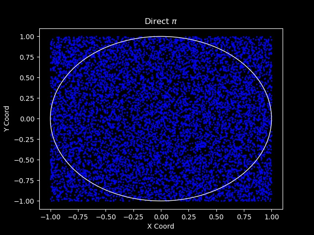
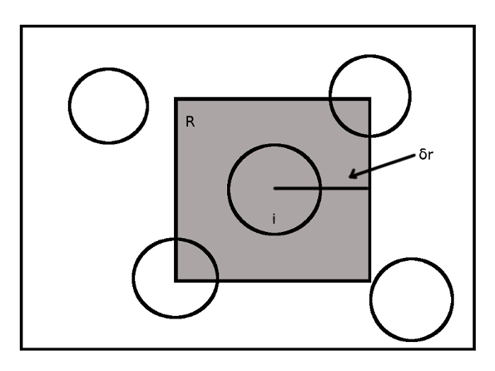
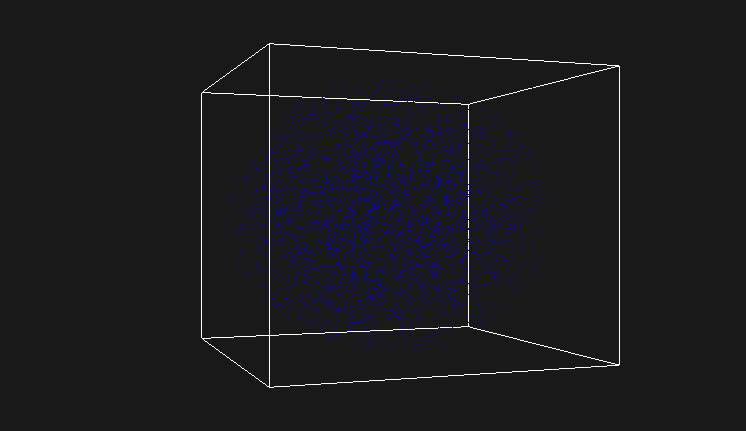
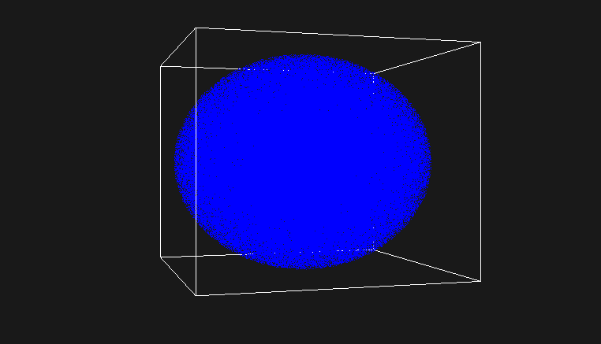

# \\(\pi\\) estimation

One simple example of the Monte Carlo simulation that is provided in many textbooks is the estimation of the Pi constant. This can be achieved by using two types of random sampling, direct or brute force sampling or by generating a Markov chain.

At first, we can see the value of \\(\pi\\) with a precision of 9 decimal digits using the cmath header in C++ with the following program.
```cpp
#include<iostream>
#include<iomanip>
#include<cmath>

int main()
{
    const double pi = acos(-1.);
    std::cout << "Pi = " << std::setprecision(10) << pi << std::endl;
    return 0;
}
```
This outputs \\(Pi = 3.141592654\\).

In 2 dimensions, we consider an inscribed circle centered at (0,0) with radius 1 inside a square with a side of 2 as it's shown in the figure below.

|{: .center-image }|
|:--:|
|The computational space|

Then by using direct sampling, we generate random numbers in the interval (-1, 1) for the x and y dimension and consequently we create random points that may be inside or outside the circle but they will certainly be inside the square. Then by counting how many points hit the circle (n) and dividing this number by the total number of random points (N) we get an approximation of the ratio of the two areas, the area of the circle divided by the area of the square
\\(\frac{n}{N}\sim\frac{\pi r^2}{(2r)^2}=\frac{\pi}{4}\\).
Finally, if we multiply this quantity with 4 we can estimate the value of \\(\pi\\). 
According to the law of large numbers, if we sample more random points we can reduce the error and get a better estimation of this value. 

In the repository named [Pi](https://github.com/anazli/pi.git), there is python code for a 2D direct and Markov sampling with visualization using the *matplotlib* library, but I also have C++ code for a 3D sampling by using a Markov Chain. I’ve also made a visualization with *OpenGL* where the coordinates of the random points are read from a file and a cube is created with *GL_LINES*.

In the C++ implementation, a Markov Chain is produced. We start from a random point in 3 dimensions and we get the next random point not just by generating 3 random numbers (x,y,z) in the interval (-1,1). Instead, the current random point is allowed to move randomly inside a cube of side \\(2\delta\\) where \\(\delta\\) is the maximum displacement and is a parameter which is controlled by us. In this case, the new random point is just the random displacement of the previous point. In the code I used my [Vec3](https://github.com/anazli/vec3) class which is equivalent to the code in comments.
```cpp

    //double current_x = random(-1.,1.);
    //double current_y = random(-1.,1.);
    //double current_z = random(-1.,1.);
    Vec3 v = randomVector(-1., 1.);

    double a = -delta;
    double b =  delta;
    
    //double dx = a + (b - a) * random(0.,1.);
    //double dy = a + (b - a) * random(0.,1.);
    //double dz = a + (b - a) * random(0.,1.);
    Vec3 dv = a + (b - a) * randomVector(0., 1.);
    
    //double new_x = current_x + dx;
    //double new_y = current_y + dy;
    //double new_z = current_z + dz;
    Vec3 new_v = v + dv;
    
    double u{1.}; //upper boundary
    double l{-1.}; //lower boundary

    //if the random displacement falls outside the computational space(cube)
    //the step is rejected and the current point is counted again.
    if(new.x() < l || new.y() < l || new.z() < l)
    {
        return v;
    }
    if(new.x() > u || new.y() > u || new.z() > u)
    {
        return v;
    }
    //otherwise the step is accepted and the new point is returned.
    acpt++;
    return new_v;
```

This is better illustrated in 2 dimensions in the figure bellow. Instead of having random points there are particles (circles) in random positions (center of the circle).

{: .center-image }

We have a particle (i) in an initial random position at the center of the shaded square. We then generate 2 uniform random numbers in the interval (0,1) and with the above code without the z coordinate we get a random displacement inside this shaded square which gives us the new random position. With this method we create a Markov Chain that consists of random states where every new state depends on the previous one. If the next random position falls outside the big square (computational space), we reject the move and stay where we were. In this case we count the current random position (state) (i) again otherwise we move the particle to the new random position. The rule of thumb is that the acceptance rate to be about 0.5, half of the total steps to be accepted. The rate can be tuned by us by changing the maximum displacement \\(\delta\)).

With this method there is a correlation between the random points that are created, because every new random point depends on the previous one but not on all previous points. 

Back to the 3D implementation, what is approximated is the fraction of two volumes, the volume of the sphere over the volume of the cube \\(\frac{\frac{4}{3}\pi r^3}{(2r)^3}=\frac{\frac{4}{3}}{8}\\) so if we multiply what we've counted \\(\frac{in sphere points}{total points}\\) with \\(8\frac{3}{4}\\) we get an estimation of \\(\pi\\).

Here are some results of the C++ implementation. The value of \\(\delta\\) was 0.8 and about half of the total steps were accepted.

|Total steps|\\(\pi\\)|
|---|---|
|1000       |3.21     |
|10000      |3.1776   |
|100000     |3.1314   |
|1000000    |3.1379   |
|10000000   |3.1415   |

And here is some visualization using *OpenGL* with 10000 and 1000000 random points respectively.

|{: .center-image }|
|:--:|
|OpenGL Visualization with 10000 random points.|

|{: .center-image }|
|:--:|
|OpenGL Visualization with 1000000 random points.|

## References

* (Oxford Master Series in Physics) Krauth W.-Statistical Mechanics_ Algorithms and Computations-Oxford University Press (2006)
* M. P. Allen, D. J. Tildesley-Computer simulation of liquids-Oxford University Press, USA (1989)

