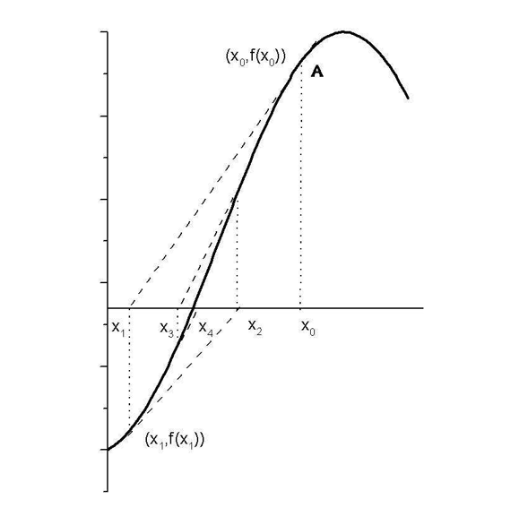

There are many mathematical equations that can't be solved by hand. Luckily we have computers to do that work for us. Iterative methods such as the bisection, the linear interpolation and the Newton-Raphson method were created to find the roots of an equation.

There is a repository named [numerical](https://github.com/anazli/numerical.git) where I add some numerical methods including functions that implement the above methods for finding the roots of an equation.

## Bisection method

We have a continuous function \\(f(x)\\) defined in the interval \\([a,b]\\) and we want to solve the equation \\(f(x) = 0\\). According to the intermediate value theorem, there is a root of this equation in a subinterval \\([a_0,b_0]\\) if \\(f(a_0)f(b_0) \lt 0\\). At every step we bisect the interval by finding the midpoint \\(\mu_0 = \frac{(a_0+b_0)}{2}\\). The steps are the following:
* if \\(f(\mu_0) = 0\\) we have found the root which is \\(\mu_0\\).
* if \\(f(\mu_0)f(a_0) \lt 0\\), define a new interval \\([a_0,\mu_0]\\).
* if \\(f(\mu_0)f(b_0) \lt 0\\), define a new interval \\([\mu_0, b_0]\\).
* repeat until \\(f(\mu_0) = 0\\).

An illustration of the method is given by the following figure on [wikipedia](https://en.wikipedia.org/wiki/Bisection_method).

|{: .center-image }|
|:--:|
|Bisection method.|

We can implement the method with the C++ code below. The function takes as input a function pointer which points to the function we want to find its root, 2 variables of type double which are the 2 limits of the interval where the root might be and one variable of type double that is the precision we want to have for our result and finally one unsigned int variable that is the number of iterations. 
```cpp
double bisection(double (*f)(const double&), double x1, double x2,const double& pre)
{
	double m{0.};
	double y1{0.}, y2{0.};
	
	y1 = f(x1);
	y2 = f(x2);

	if (y1 * y2 < 0.) {
		
		while (fabs(x1 - x2) > pre) {

			m = (x1 + x2)/2.;

			double y3 = f(m);
			if (y1 * y3 < 0.) {
				x2 = m;
			}
			else {
				x1 = m;
			}
		}

		return m;
	}
	else {
	    cout << "There isn't exaclty one root in the given interval." << endl;
		return INFINITY;
	}

}
```

As an example if we apply the method on the equation \\(x^2 + \sin{x} + e^x -2 = 0\\) which has 2 roots \\(x_1 = -1.675502\\) and \\(x_2 = 0.387082\\), as we can also see on the [Wolfram Alpha](https://www.wolframalpha.com/input/?i=x*x+%2B+sin%5Bx%5D+%2B+exp%5Bx%5D+-+2) computational engine, and we set the interval to be \\([-3,-1]\\) for the first root with a precision of \\(10^{-3}\\) we get \\(x_1 = -1.675\\). The root has been found after 11 iterations of the method. If we set another interval the number of iterations may change.

What makes this method less attractive is its slow convergence and that is dangerous when the function has discontinuities.

## Linear interpolation method

There is another method to find the root of an equation which is called linear interpolation and converges faster that the bisection method. If we have a function \\(f(x)\\) which has a root in the interval \\([x_1,x_2]\\) that is \\(f(x_1)f(x_2) \lt 0\\) then we take the straight line between the points \\((x_1,f(x_1))\\) and \\((x_2,f(x_2))\\) with the form \\(y(x) - f(x_2) = \frac{f(x_2) - f(x_1)}{x_2 - x_1}(x - x_2)\\), this line passes the x axis at a point \\(x_3\\) which is given by the following equation \\(x_3 = x_2 - \frac{f(x_2)}{f(x_2) - f(x_1)}(x_2 - x_1)\\). This new point is closer to the root so if we repeat this process we can finally find the root. 

The general form of this equation which gives us the next point at every iteration is \\(x_{n+2} = x_{n+1} - \frac{f(x_{n+1})}{f(x_{n+1}) - f(x_{n})}(x_{n+1} - x_{n})\\). 

Starting with an interval \\([x_1,x_2]\\) we may not necessarily include the root, the steps of the method are the following
* if \\(f(x_3) = 0\\), we have found the root
* if \\(f(x_1)f(x_3) \lt 0\\), set \\(x_2 = x_3\\)
* if \\(f(x_2)f(x_3) \lt 0\\), set \\(x_1 = x_3\\)
* repeat until \\(f(x_3) = 0\\)

The following figure shows a few steps of the method.

|{: .center-image }|
|:--:|
|Linear interpolation.|

We can implement this method with the following function in C++ which you can find [here](https://github.com/anazli/numerical.git). The function takes as input the same parameters as the bisection method above.
```cpp
double linear_interpolation(double (*f)(const double&), double x1, double x2, const double& pre) 
{

	double x3(0.);
	double y1(0.), y2(0.);

	y1 = f(x1);
	y2 = f(x2);

	double y3(1.);

	while (fabs(y3) > pre) {

		y1 = f(x1);
		y2 = f(x2);

		x3 = x2 - y2 * (x2 - x1)/(y2 - y1);
		y3 = f(x3);

		if (y3 * y1 < 0.)
			x2 = x3;
		else
			x1 = x3;

	}

	return x3;
}
```

If we run this routine with the same parameters as the bisection method, we get the same results after 9 iterations but this also depends on the choise of the initial interval.

A few comments on the method are that 
* is faster than the bisection method.
* the initial interval need not necessarily include the root.
* if the form of the function near the root is linear the convergence is faster.
* the convergence is one-sided (biased) because one of the 2 initial points doesn't change. This can be improved using other methods.

## Newton -- Raphson method

Finally, there is a method that is faster than the others, the Newton -- Raphson method. One drawback of this method is that we must know the form of the first derivative of the function we want to find its root. If near the root of a function \\(f(x)\\) its first and second derivative are continuous we can implement this method and find the root faster than with the past two methods. We start from an initial point which is our first estimation of the root. The derivative pass the x axe at a point \\(x_1\\) as its shown in the figure below. In the right-angled triangle \\(x_0x_1A\\) we find that \\(\tan{\theta} = f'(x_0) = \frac{f(x_0)}{x_1 - x_0}\\), thus \\(x_1 = x_0 - \frac{f(x_0)}{f'(x_0)}\\)
where \\(\theta\\) is the angle \\(A\hat{x_1}x_0\\).

So the iterative form of the method is \\(x_{n+1} = x_n - \frac{f(x_n)}{f'(x_n)}\\)

|{: .center-image }|
|:--:|
|Newton -- Raphson.|

Below follows the C++ code of the method which can be found [here](https://github.com/anazli/numerical.git). The inputs are 2 function pointers for the function and its derivative, one variable of type double that is the initial estimation of the root, one double which defines the precision and one unsigned int which is the number of iterations.

```cpp
double newton_raphson(double (*f)(const double&), double (*df)(const double&), double init_point, const double& pre, unsigned int& iter)
{
	while (fabs(f(init_point)) > pre) {

		double y = f(init_point);
		double ydot = df(init_point);

		init_point -= y/ydot;
		iter++;
	}

	return init_point;
}
```

For the previous example if we choose an initial point like -2 or -3 we find the result -1.676 after 4 iterations.
